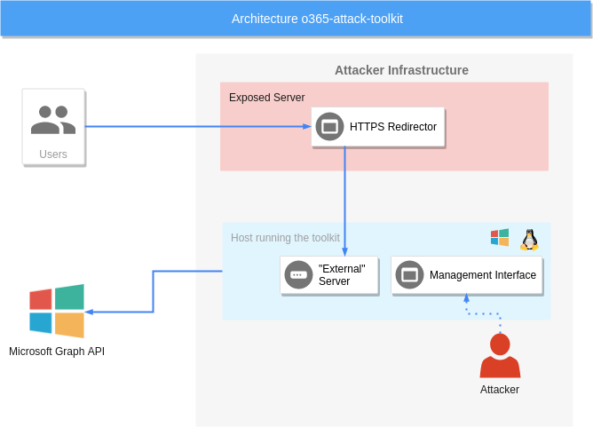
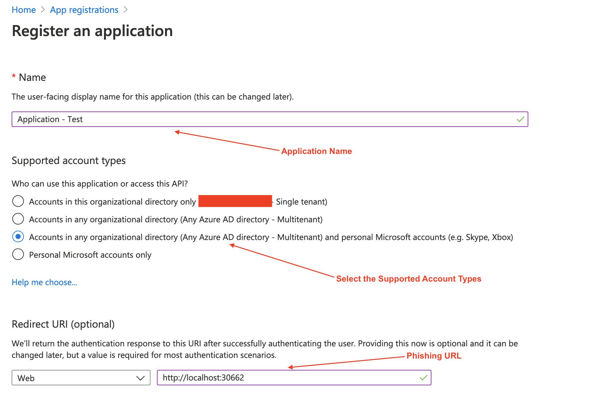
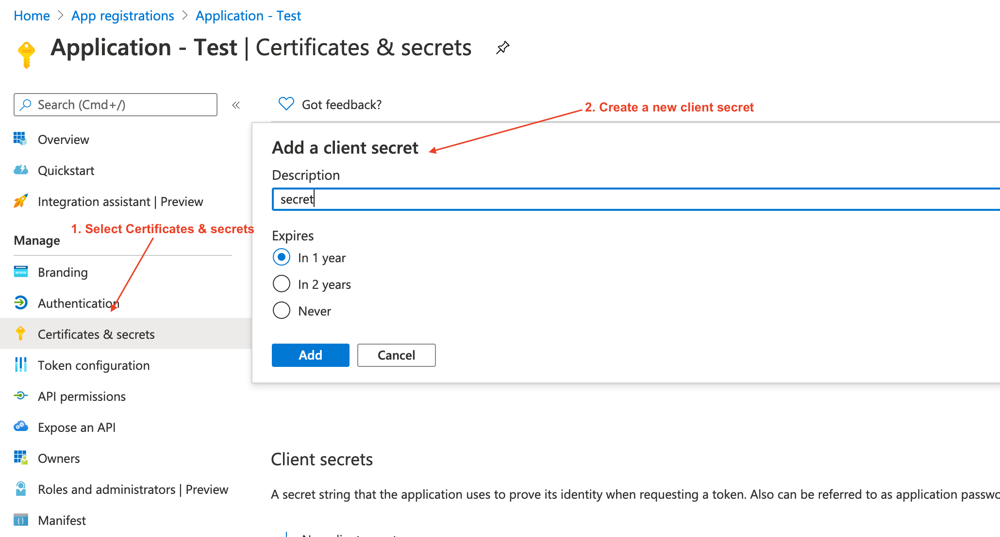
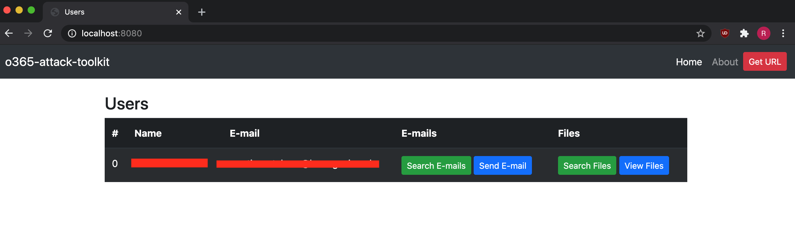
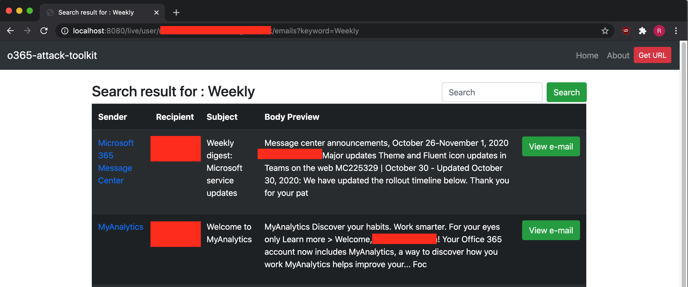
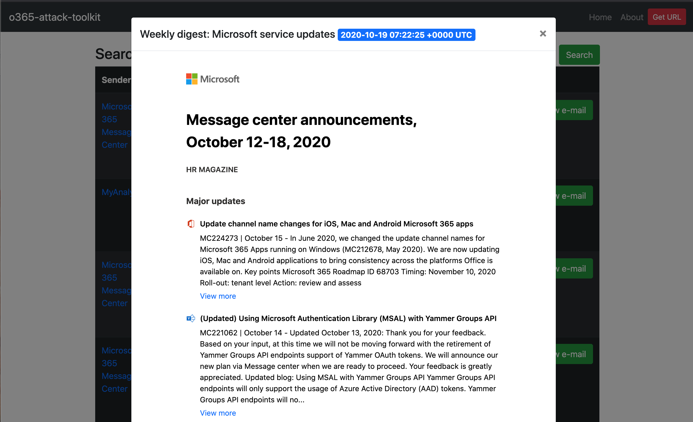
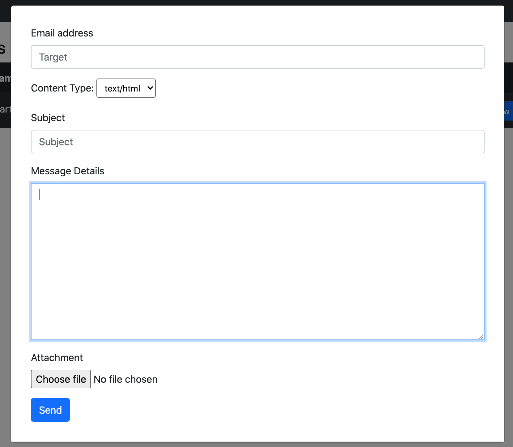
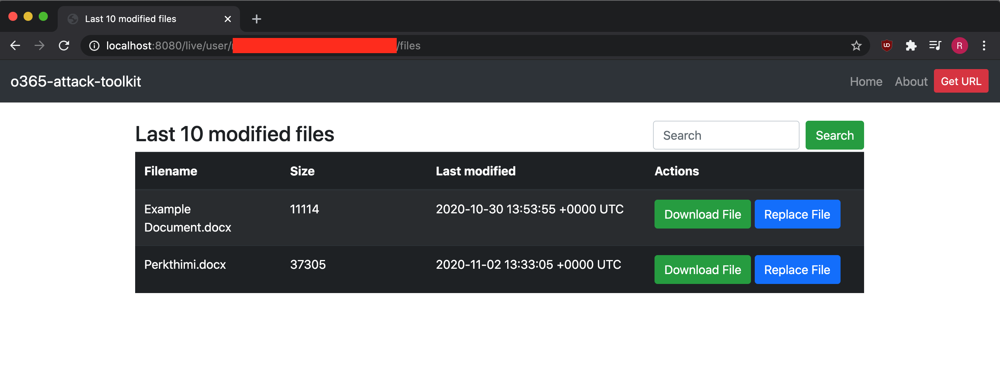
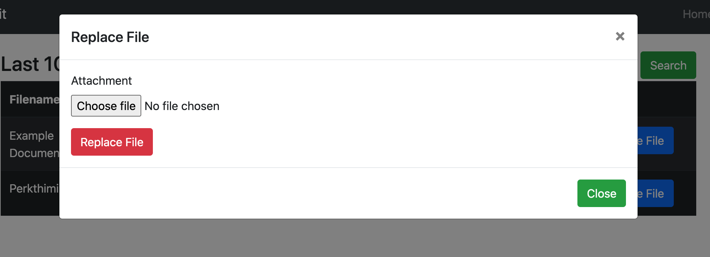

## What is o365-attack-toolkit

o365-attack-toolkit allows operators to perform oauth phishing attacks.

We decided to move from the old model of static definitions to fully "interactive" with the account in real-time.

### Some of the changes
* Interactive E-mail Search - Allows you to search for user e-mails like you would having full access to it.
* Send e-mails - Allows you to send HTML/TEXT e-mails with attachments from the user mailbox.
* Interactive File Search and Download - Allows you to search for files using specific keywords and download them offline.
* File Replacement - Implemented as a replacement for the macro backdooring functionality.


## Architecture



### The toolkit consists of several components
### Phishing endpoint
The phishing endpoint is responsible for serving the HTML file that performs the OAuth token phishing.
### Backend services
Afterward, the token will be used by the backend services to perform the defined attacks.
### Management interface
The management interface can be utilized to inspect the extracted information from the Microsoft Graph API.

## Features

### Interactive E-mail Search
User e-mails can be accessed by searching for specific keywords using the management interface. The old feature of  downloading keyworded e-mails has been discontinued.

### Send E-mails
The new version of this tool allows you to send HTML/TXT e-mails, including attachments to a specific e-mail address from the compromised user. This feature is extremly useful as sending a spear-phishing e-mail from the user is more belivable.

### File Search
Microsoft Graph API can be used to access files across OneDrive, OneDrive for Business and SharePoint document libraries.
User files can be searched and downloaded interactively using the management interface. The old feature of downloading keyworded files has been discontinued. 

### Document Replacing
Users document hosted on OneDrive/Sharepoint can be modified by using the Graph API. In the initial version of this toolkit, the last 10 files would be backdoored with a pre-defined macro. This was risky during Red Team operations hence the limited usage. For this reason, we implemented a manual file replacement feature to have more control over the attack.


## How to set up

### Compile

```
cd %GOPATH%
git clone https://github.com/mdsecactivebreach/o365-attack-toolkit
cd o365-attack-toolkit
dep ensure
go build
```

### Configuration

An example configuration as below :
```
[server]
host = 127.0.0.1
externalport = 30662
internalport = 8080


[oauth]
clientid = [REDACTED]
clientsecret = [REDACTED]
scope = "offline_access contacts.read user.read mail.read mail.send files.readWrite.all files.read files.read.all openid profile"
redirecturi = "http://localhost:30662/gettoken"
```


### Deployment
Before start using this toolkit you need to create an Application on the Azure Portal.
Go to Azure Active Directory -> App Registrations -> Register an application.



After creating the application, copy the Application ID in the configuration file.

You need to create a client secret which can be done as shown on the following image:



Update the client secret on the configuration file.

## Management Interface

The management interface allows the operator to interact with the compromised users. 

### Users View



### Search User E-mails




### View E-mail



### Send E-mail



### Search Files



### Replace File


